# BIthere

**AI Business Intelligence Analyst**

*Natural Language Query · Auto-Dashboard Generation · Actionable Insights · Multi-Agent Orchestration · Big Data Optimization*

[](https://opensource.org/licenses/MIT)
[](https://www.python.org/)
[](https://fastapi.tiangolo.com/)
[](https://reactjs.org/)
[](https://langchain.com/langgraph)
[](https://groq.com/)
[](https://pinecone.io/)
[](https://supabase.com/)
[](https://redis.io/)
[](https://metabase.com/)
[](https://docker.com/)

---

## Executive Summary

BIthere is an AI-powered Business Intelligence platform that enables non-technical users to query enterprise data using natural language and receive interactive dashboards, executive insights, and deliverable reports in a single workflow.

The system is designed for organizations where business users depend on data analysts to answer routine questions. It eliminates that dependency by translating a plain-language question into a validated SQL query, executing it against a live data warehouse, generating a ranked visualization dashboard, and delivering the result through email, Slack, or PDF.

**Version 2** evolves BIthere from a single-user platform into a **multi-tenant, self-service, corporate-ready** platform with bring-your-own-keys, bring-your-own-data, multi-database support, and an **iterative dashboard editor** based on a patch engine.

---

## Key Highlights & Interface Preview

<div align="center">

| Authentication & NL Prompt | Generated Dashboard & Insight |
| :---: | :---: |
| 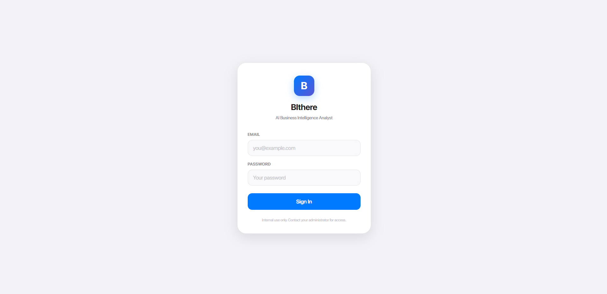<br/>*Secure JWT-based session login* | 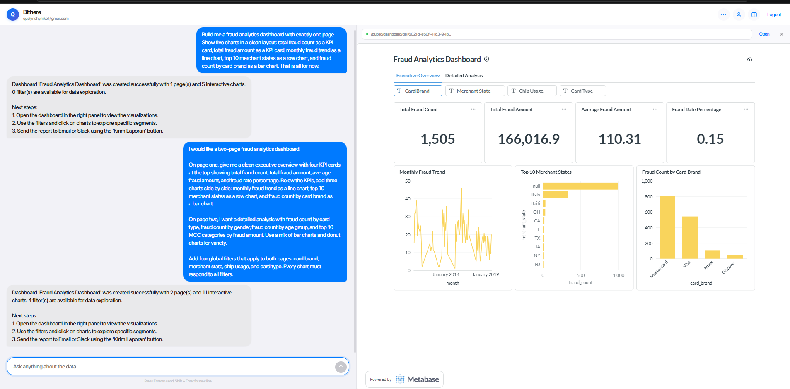<br/>*Auto-generated visualization dashboard* |
| 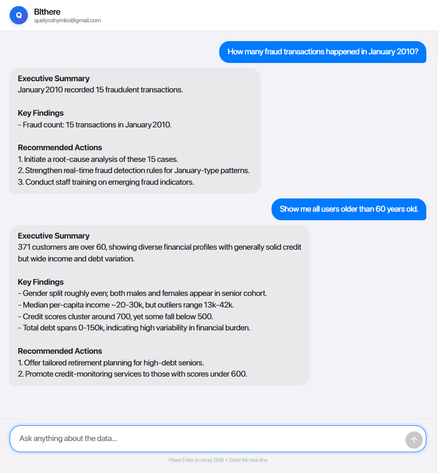<br/>*Natural language query entry* | 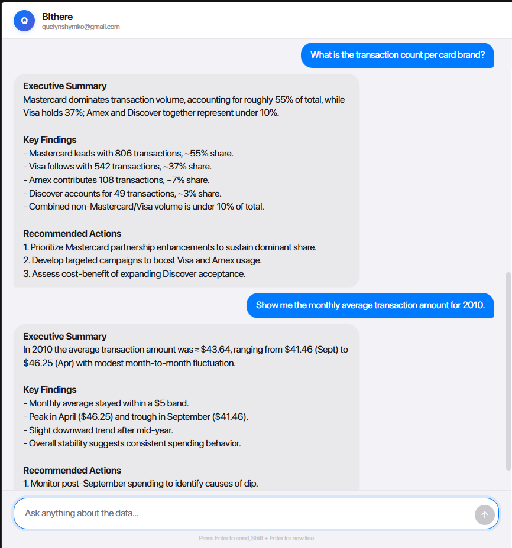<br/>*AI-generated executive summary & findings* |

</div>

---

## Business Impact

| Metric | Manual Baseline | With BIthere | Improvement |
| :--- | :--- | :--- | :--- |
| Time to first insight | 4 to 48 hours (analyst queue) | Under 15 seconds | Over 99 percent reduction |
| Dashboard creation | 2 to 4 hours per dashboard | Under 90 seconds | Over 98 percent reduction |
| Report delivery | Manual email or export | Automated with screenshots and PDF | Zero manual effort |
| Cost per query | Analyst hourly rate | Under 0.01 USD (with caching) | Over 99 percent reduction |
| Cache hit rate | Not applicable | 60 to 70 percent in steady state | Direct API cost reduction |

---

## Key Features

### 1. Natural Language Query (NLQ)
Users type questions such as *"How many fraud transactions occurred in January 2010?"* or *"Show me the monthly fraud trend by card brand"* and the system produces a validated SQL query without manual intervention.

The NLQ pipeline includes:

- Intent classification (query, dashboard, report, or combined)
- Retrieval-Augmented Generation over the database schema and business glossary
- Schema-aware SQL generation with anti-hallucination guardrails
- Safety validation (SELECT only, no destructive statements)
- Automatic optimization (index-aware filters, LIMIT injection)
- Execution against PostgreSQL with automatic retry on connection drop

### 2. Auto-Dashboard Generation
The system converts a single natural-language prompt into a fully populated, interactive multi-page dashboard hosted on Metabase.

Supported capabilities:

- Multi-page dashboards with tab navigation
- Up to 17 charts per dashboard (KPI cards, bar, line, area, donut, funnel, scatter, waterfall, table, gauge, map)
- Global filters bound to every chart on every page
- Click-through cross-filtering between charts
- Automatic public embed URL generation
- Persistent storage of dashboard configuration in PostgreSQL

### 3. Actionable Insights
Every query result is summarized into a concise executive insight by a dedicated agent. The output follows a consistent structure:

- Executive summary (one paragraph)
- Key findings (three to five bullet points)
- Recommended actions (one to three items)

### 4. Multi-Agent Orchestration (LangGraph)
A LangGraph workflow coordinates specialized agents:

| Agent | Responsibility |
| :--- | :--- |
| Planner Agent | Analyzes intent and determines required actions |
| Guard Agent | Rejects out-of-scope or ambiguous questions |
| RAG Retrieval | Fetches relevant schema and glossary context from Pinecone |
| Cache Check | Resolves Redis cache hits for query, LLM response, and dashboard configuration |
| Query Generator | Produces a schema-correct SQL query |
| Validator | Enforces safety rules and blocks destructive statements |
| Query Optimizer | Rewrites query for index usage and avoids full table scans |
| Query Executor | Runs the query with auto-reconnect on connection loss |
| Insight Analyzer | Produces the executive insight |
| Dashboard Builder | Generates Metabase dashboard configuration |
| Report Sender | Dispatches reports through email, Slack, or PDF |
| Response Builder | Streams the final answer and writes cache |

### 5. Retrieval-Augmented Generation (RAG)
Metadata, table schemas, column descriptions, historical queries, and the business glossary are embedded and stored in Pinecone. Retrieval combines semantic similarity with keyword matching, and the resulting context is injected into the query generation prompt.

### 6. Caching and Cost Optimization

| Cache Layer | Key Pattern | TTL | Purpose |
| :--- | :--- | :--- | :--- |
| Query Result | `query:{hash}` | 1 hour | Skip SQL execution for repeated prompts |
| LLM Response | `llm:{hash}` | 1 hour | Skip LLM calls for identical inputs |
| Embedding | `embedding:{hash}` | 24 hours | Skip embedding API calls |
| Dashboard Config | `dashboard:{id}` | 1 hour | Skip dashboard regeneration |
| Metadata | `metadata:{table}` | 6 hours | Fast schema lookup |

### 7. Report Delivery
Insights and dashboards can be delivered through three channels:

- Email with inline dashboard screenshots and an attached PDF report
- Slack notifications with dashboard URL
- PDF export with a consultant-grade template

### 8. Role-Based Access Control

| Role | Permissions |
| :--- | :--- |
| Admin | Invite users, manage roles, access audit logs, view system usage |
| Analyst | Query data, generate dashboards, send reports |

### 9. Audit Trail and Governance
Every user action is recorded and available for review:

- Query history with prompt, generated SQL, status, and timestamp
- Ingestion logs for metadata synchronization
- Dashboard configuration snapshots
- User activity timeline

### 10. Dynamic Database Connectors
An abstraction layer allows the system to connect to PostgreSQL, MySQL, MongoDB, SQLite, or DuckDB without changing the core agent logic.

---

## Additional Interface Screenshots

### Chat Interface

<div align="center">
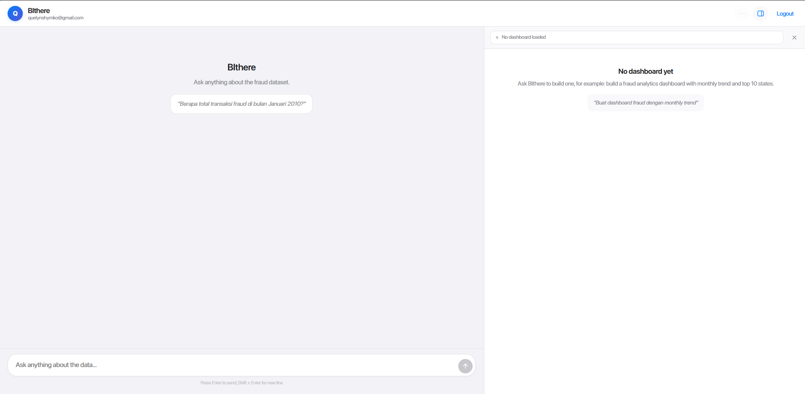
<br/>
<em>Streaming chat interface with support for multiple conversation sessions.</em>
</div>

### Multi-Tenant Workspace & Sidebar Navigation

<div align="center">
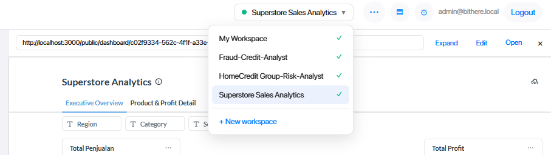
<br/>
<em>Workspace switcher in the top navigation — jump between tenants without reloading.</em>
</div>

### Integrations Manager — Bring Your Own Keys

<div align="center">
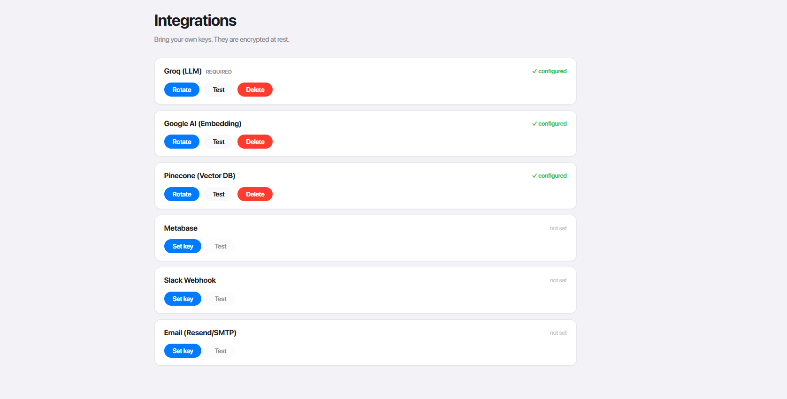
<br/>
<em>Per-workspace API keys: input, test connectivity, rotate, and delete. All values encrypted with Fernet.</em>
</div>

### Dataset Catalog & Upload

<div align="center">
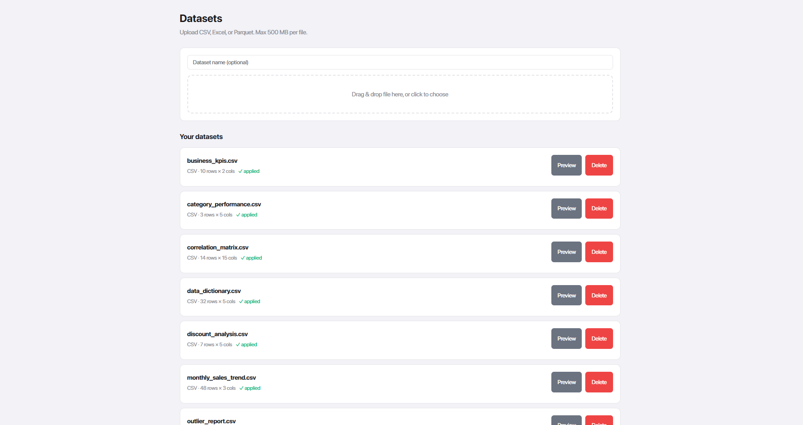
<br/>
<em>Upload CSV / Excel / Parquet. Preview rows, edit column types, and drop the dataset along with its underlying table.</em>
</div>

### Knowledge Base — Schema Tab

<div align="center">
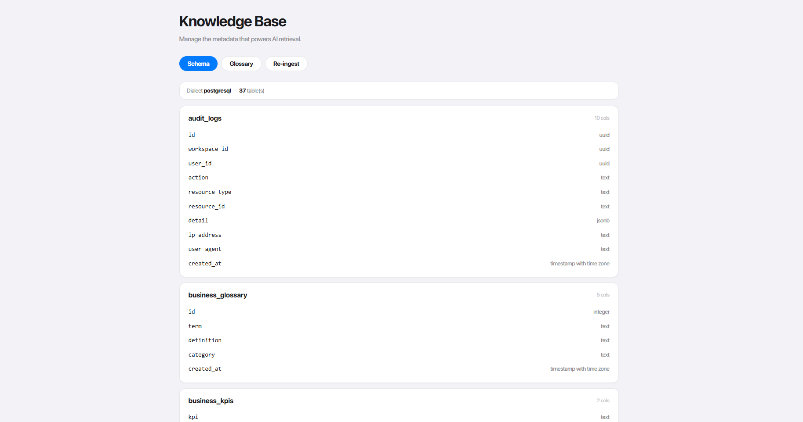
<br/>
<em>Live schema view of the connected data source, used by the RAG layer for schema-aware SQL generation.</em>
</div>

### Iterative Dashboard Editor (F-13) — Patch-Based Editing

A flagship v2 feature: **edit dashboards incrementally via chat — not regenerate from scratch.** Every instruction becomes a structured patch that touches only the requested parts. Everything else stays intact.

<div align="center">

**Editor Overview**

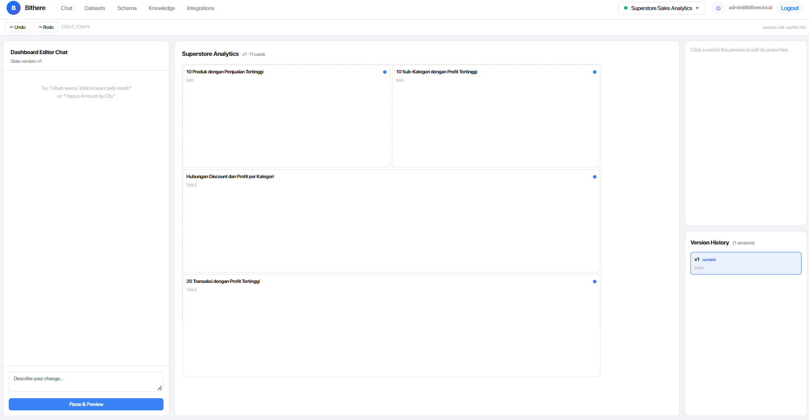
<br/>
<em>Split view: chat panel (left), live preview (center), property panel and version history (right).</em>

<br/><br/>

**Before — Broken Dashboard Needs Editing**


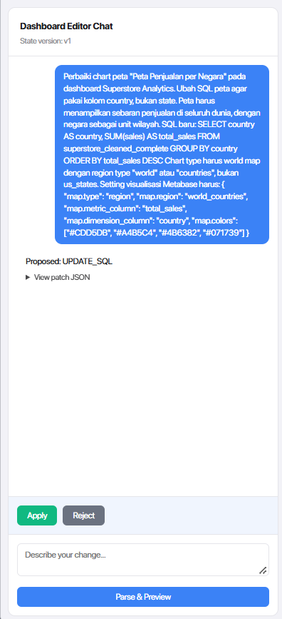
<br/>
<em>Left: dashboard with issue. Right: proposed patch preview in the chat panel with the patch JSON viewer.</em>

<br/><br/>

**Patch Applied — Dashboard Fixed Without Regenerating**


<br/>
<em>Only the targeted chart changed. All other charts, colors, positions, and filters stay intact.</em>

<br/><br/>

**Live Properties Panel**

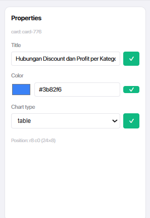
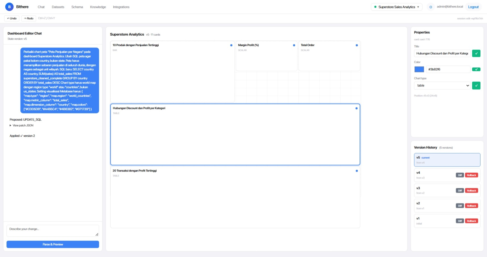
<br/>
<em>Left: property panel — change title, color, chart type. Right: manual drag/resize canvas with live position badge.</em>

<br/><br/>

**Version History & Diff**

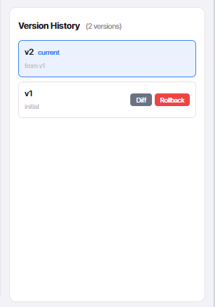
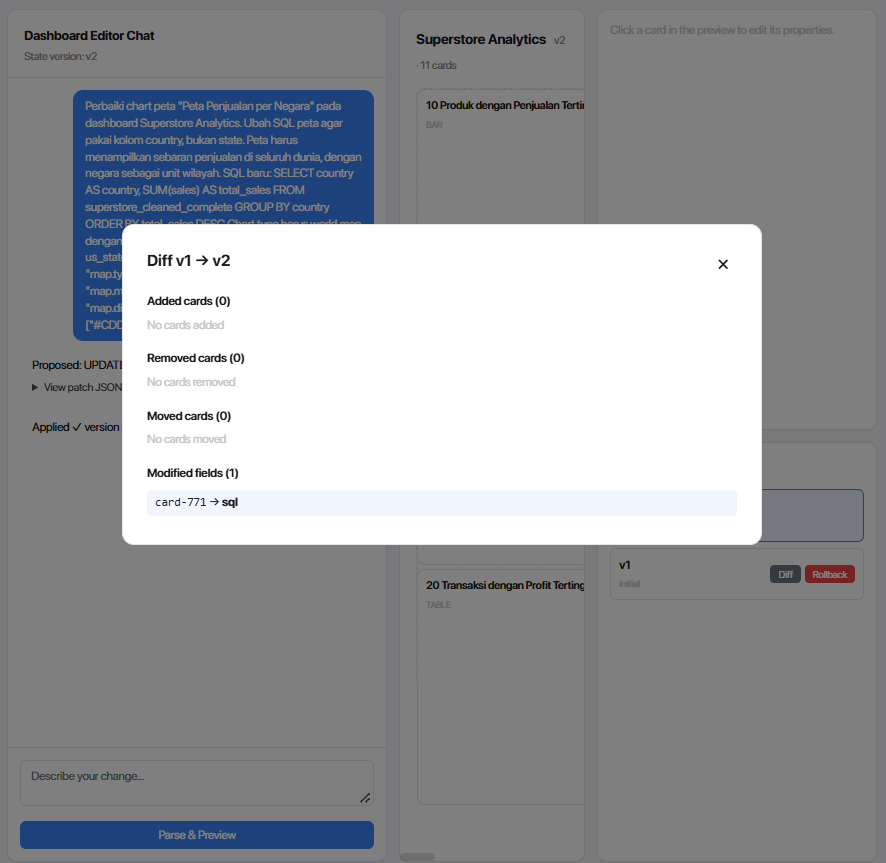
<br/>
<em>Left: version timeline with rollback per version. Right: diff viewer comparing two versions field by field.</em>

</div>

### Multi-Page Dashboard & Filtering

<div align="center">
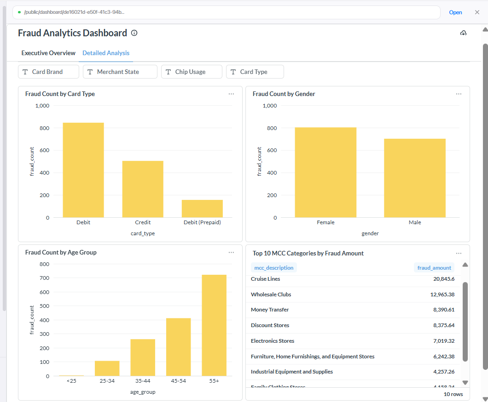
<br/>
<em>Second page of the dashboard with detailed segment analysis.</em>
<br/><br/>
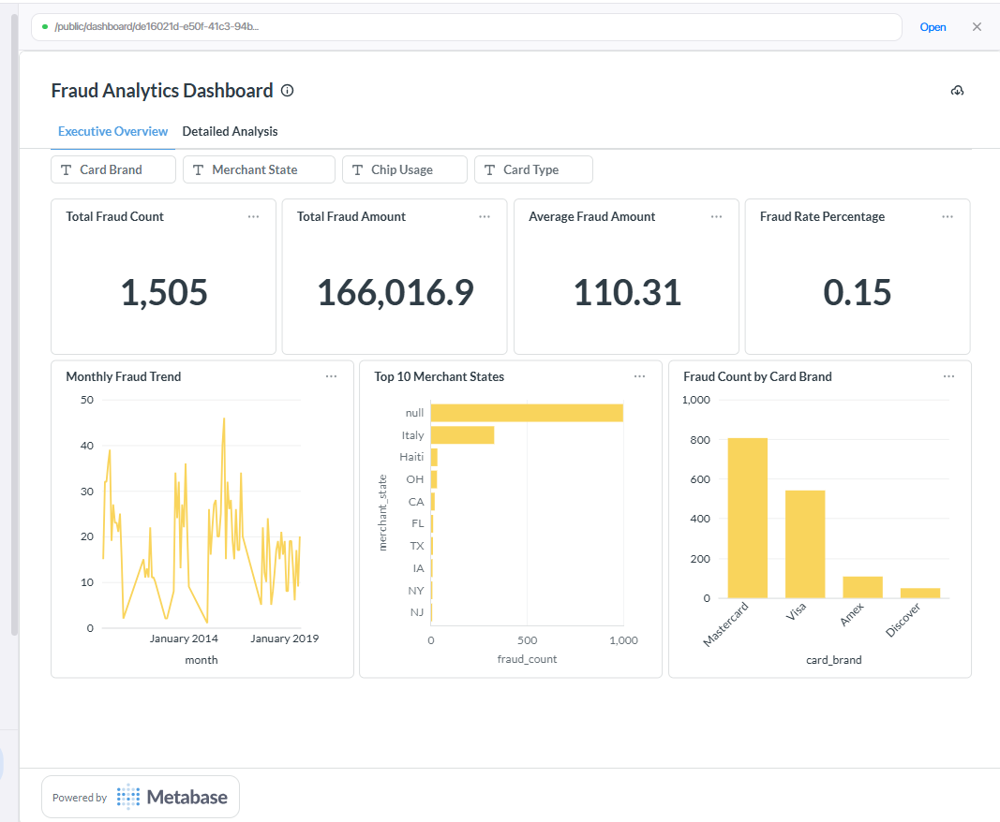
<br/>
<em>Global filters bound to every chart across all pages.</em>
<br/><br/>
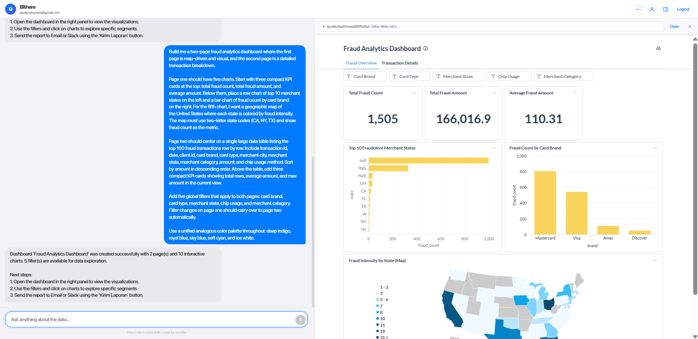
<br/>
<em>Clicking a chart segment automatically applies the corresponding filter.</em>
<br/><br/>
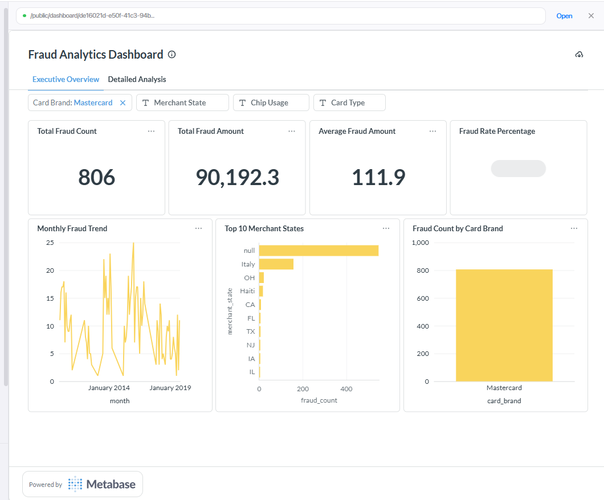
<br/>
<em>Clicking a chart segment automatically applies the corresponding filter.</em>
</div>

### Report Delivery & Notifications

<div align="center">

<br/>
<em>Reports dispatched through email, Slack, or exported as PDF.</em>
<br/><br/>

<br/>
<em>Real-time Slack alerts with dashboard URL and summary.</em>
<br/><br/>

<br/>
<em>Email report rendered on mobile with inline dashboard screenshots.</em>
</div>

### Admin & User Management

<div align="center">
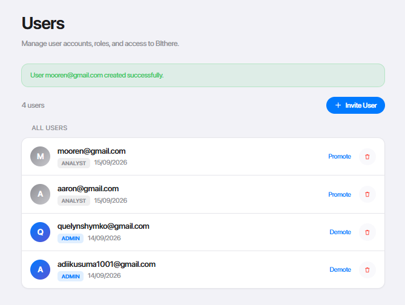
<br/>
<em>User management with role control, invitation flow, and audit visibility.</em>
<br/><br/>
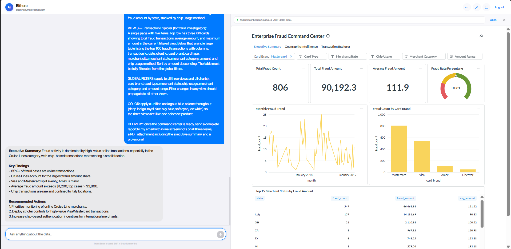
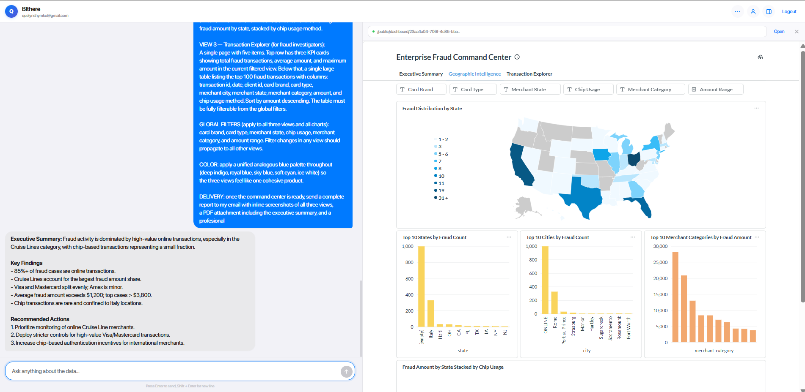
<br/>
<em>Admin-only workflow for inviting new users with role assignment.</em>
</div>

### Admin — Workspace Invites & User Creation

<div align="center">
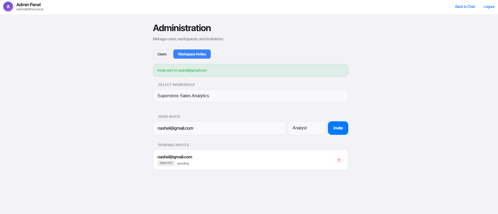
<br/>
<em>Admin-only page: send email-based invites per workspace, choose role (admin / analyst / viewer).</em>

<br/><br/>


<br/>
<em>Alternative flow: admin creates an account directly with a temporary password.</em>
</div>

---

## System Architecture

```text
User Input (Natural Language)
│
▼
┌─────────────────────────────────────────────────────────┐
│                    FastAPI Backend                      │
│  ┌───────────────────────────────────────────────────┐  │
│  │   Auth Middleware (Supabase JWT)                  │  │
│  └───────────────────────────────────────────────────┘  │
│  ┌───────────────────────────────────────────────────┐  │
│  │   LangGraph Orchestrator                          │  │
│  │                                                   │  │
│  │   Planner → Guard → RAG → Cache Check             │  │
│  │      ↓                                            │  │
│  │   Query Generator → Validator → Optimizer         │  │
│  │      ↓                                            │  │
│  │   Query Executor (Supabase PostgreSQL)            │  │
│  │      ↓                                            │  │
│  │   Insight Analyzer (Groq Llama 3.3 70B)           │  │
│  │      ↓                                            │  │
│  │   Dashboard Builder (Metabase API)                │  │
│  │      ↓                                            │  │
│  │   Report Sender (Slack, Email, PDF)               │  │
│  └───────────────────────────────────────────────────┘  │
│  ┌───────────────────────────────────────────────────┐  │
│  │   MCP Tool Server                                 │  │
│  │   fetch_data, send_slack, send_email,             │  │
│  │   render_dashboard, export_pdf                    │  │
│  └───────────────────────────────────────────────────┘  │
│  ┌───────────────────────────────────────────────────┐  │
│  │   Redis Cache                                     │  │
│  │   query, llm, embedding, dashboard, metadata      │  │
│  └───────────────────────────────────────────────────┘  │
└─────────────────────────────────────────────────────────┘
│
▼
Streaming Response (SSE) → React Frontend
```

---

## UPDATE FEATURES V2

### 1. UPDATE WORKSPACE — Multi-Tenant, Self-Service, Corporate-Ready

Version 2 transforms BIthere from a single-user platform into a fully multi-tenant, self-service BI platform. Every user can have their own workspace, their own API keys, their own datasets, and their own knowledge base — all isolated from each other.

**Vision:** `Clone → Configure → Upload → Query`. Four steps, no developer.

#### 1.1 New Capabilities at a Glance

| ID | Feature | Description | Priority |
| :--- | :--- | :--- | :--- |
| F-01 | Setup Wizard | Six-step self-service onboarding | P0 |
| F-02 | Integration Manager | Per-workspace API key input, test, rotate | P0 |
| F-03 | Dynamic Data Source | PostgreSQL, MySQL, MongoDB, SQLite, DuckDB | P0 |
| F-04 | Dataset Upload | CSV / Excel / Parquet with preview and type editor | P0 |
| F-05 | Schema Builder | Auto-generate DDL, edit, apply, rollback | P0 |
| F-06 | Knowledge Base (RAG) | Manage schema, glossary, and query history | P1 |
| F-07 | Workspace Management | Multi-user, role, invite, audit | P0 |
| F-08 | Usage & Audit | Activity log + statistics + cost | P2 |
| F-09 | Encrypted Vault | Secure secret storage using Fernet | P0 |
| F-10 | Multi-Tenant Isolation | RLS + Pinecone namespace + Redis prefix | P0 |
| F-11 | Rate Limit Handler | Backoff + queue + user feedback | P2 |
| F-13 | Iterative Dashboard Editor | Patch-based conversational editing | P0 |

#### 1.2 Setup Wizard — Six-Step Onboarding

The first time a user creates a workspace, they are guided through a six-step wizard. No code, no `.env` edits, no Docker restart.

<div align="center">

| Step 1 — Account | Step 2 — API Keys |
| :---: | :---: |
| <br/>*Create or confirm workspace name* | 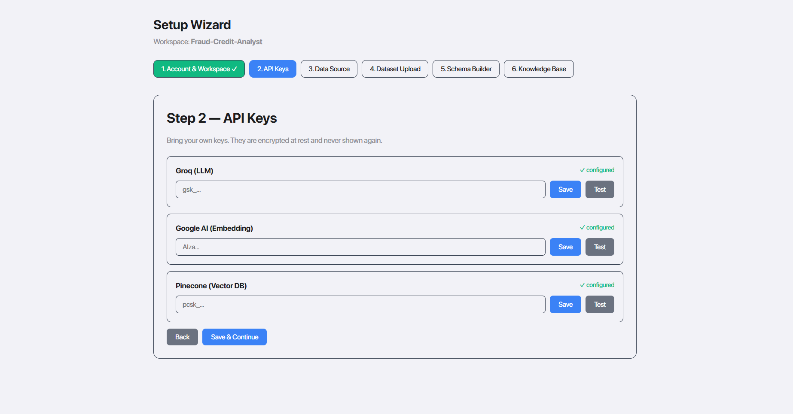<br/>*Bring your own Groq, Google, and Pinecone keys* |

| Step 3 — Data Source | Step 4 — Dataset Upload |
| :---: | :---: |
| 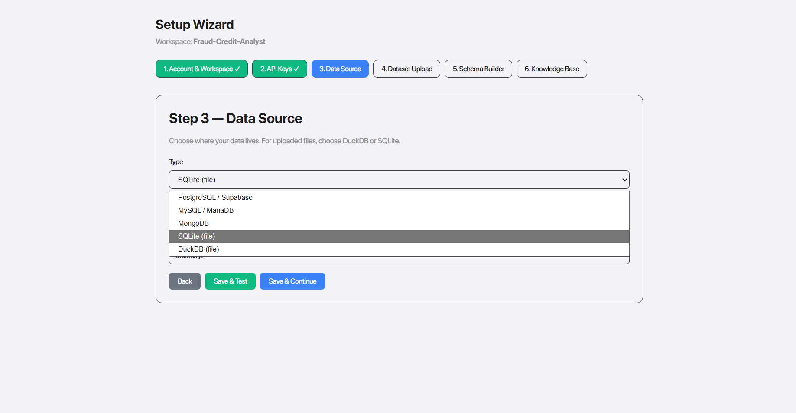<br/>*Pick database type and provide connection* | 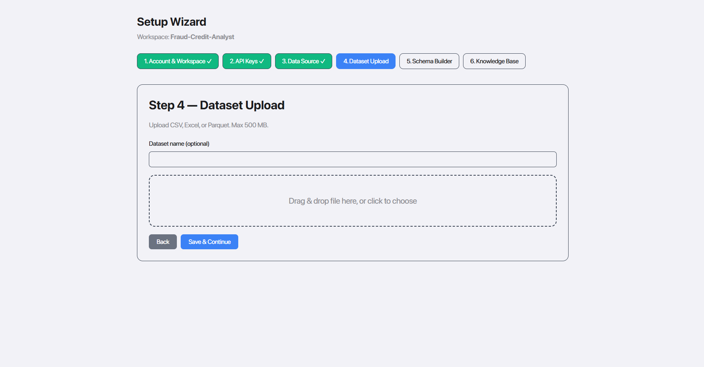<br/>*Upload CSV, Excel, or Parquet* |

| Step 5 — Schema Builder | Step 6 — Knowledge Base |
| :---: | :---: |
| 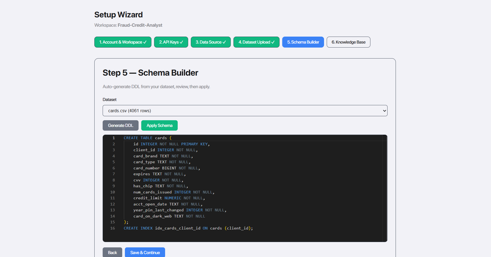<br/>*Auto-generate DDL, review, apply* | 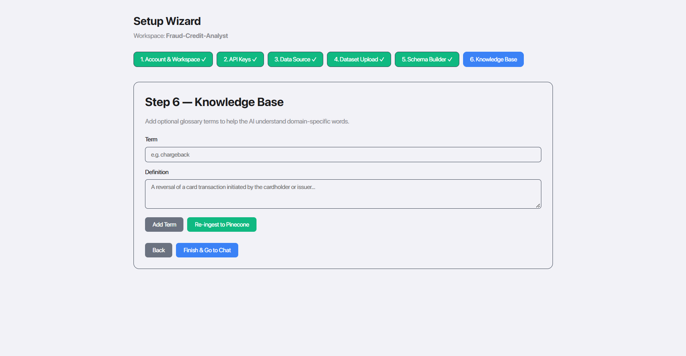<br/>*Add glossary and re-ingest to Pinecone* |

</div>

Each step can be skipped, resumed after logout, and revisited later through the workspace settings.

#### 1.3 Bring-Your-Own-Keys — Encrypted Vault

Each workspace stores its own API keys (Groq, Google, Pinecone, Metabase, Slack, Email) encrypted with **Fernet symmetric encryption** using a `MASTER_ENCRYPTION_KEY` that lives only on the server.

- Keys are **never** sent to the frontend — only masked previews (`gsk_****1234`)
- Rotate keys without downtime
- Every change recorded in `audit_logs`
- Every request validated per workspace

#### 1.4 Bring-Your-Own-Data

Users can upload their own dataset in three formats:

- **CSV** — automatic delimiter sniffing, encoding detection
- **Excel** — `.xlsx`, `.xls`
- **Parquet** — columnar, fast for large datasets

The system previews the first 100 rows, detects column types automatically, and lets the user edit them. Data can be stored in local DuckDB for fast analytics or pushed to the workspace PostgreSQL.

#### 1.5 Dynamic Data Source Connector

An abstraction layer via connector factory:

- **PostgreSQL / Supabase**
- **MySQL / MariaDB**
- **MongoDB** (aggregation pipeline)
- **SQLite**
- **DuckDB** (file per workspace)

Adding a new connector does not change the core agent logic. Every data source can be tested directly from the UI.

#### 1.6 Schema Builder — DDL Generation and Review

The system auto-generates `CREATE TABLE` from an uploaded dataset:

- Primary key detection from naming conventions
- Foreign key detection from `{table}_id` pattern
- Index suggestion for frequently filtered columns
- Partition suggestion for tables over 10 million rows
- Monaco Editor for DDL review and edit before apply
- Automatic rollback if needed

#### 1.7 RAG Self-Service — Knowledge Base

Each workspace manages its own knowledge base in a Pinecone namespace `workspace_{uuid}/`:

- **Schema metadata** — auto-generated from Schema Builder
- **Business Glossary** — upload CSV or fill a form
- **Query History** — automatically saved from successful queries for few-shot retrieval

Full isolation between tenants: workspace A cannot access workspace B's namespace.

#### 1.8 Multi-Tenant Isolation — Defense in Depth

Isolation at six layers:

| Layer | Strategy |
| :--- | :--- |
| JWT | Custom `workspace_id` claim |
| Application DB | Row-Level Security per workspace |
| Source DB | Connection string per workspace |
| Vector DB | Pinecone namespace per workspace |
| Cache | Redis key prefix `ws:{workspace_id}:` |
| File upload | Folder `uploads/{workspace_id}/` |

#### 1.9 Iterative Dashboard Editor (F-13)

A flagship v2 feature: **edit dashboards via chat, incrementally — not regenerate.**

Every user instruction becomes a **structured patch** that touches only the requested parts. Everything else stays intact: color, position, query, filter — unchanged unless mentioned.

**Interaction example:**

| Iteration | User Instruction | Patch Applied |
| :--- | :--- | :--- |
| 1 | "Buat dashboard fraud dengan KPI cards, monthly trend, dan top 10 states" | Dashboard v1 created |
| 2 | "Tambahkan chart bar di atas 'Top 10 States'" | `ADD_CARD` |
| 3 | "Tukar posisi 'Monthly Trend' dan 'Fraud by Card Brand'" | `SWAP_CARDS` |
| 4 | "Ubah warna 'Monthly Trend' jadi merah" | `CHANGE_COLOR` |
| 5 | "Tambahkan filter card_brand" | `ADD_FILTER` |
| 6 | "Hapus chart 'Top 10 States'" | `REMOVE_CARD` |
| 7 | "Kembalikan ke versi 4" | `ROLLBACK_TO_VERSION` |

**13 patch types supported:**

`ADD_CARD`, `REMOVE_CARD`, `MOVE_CARD`, `SWAP_CARDS`, `RESIZE_CARD`, `CHANGE_COLOR`, `CHANGE_TITLE`, `CHANGE_CHART_TYPE`, `UPDATE_SQL`, `ADD_FILTER`, `REMOVE_FILTER`, `ROLLBACK_TO_VERSION`, `COMPOSITE`.

**Supporting capabilities:**

- **Version Control** — every patch becomes a new version with parent reference
- **Rollback** — return to any version without data loss
- **Live Preview** — see the change before applying
- **Property Panel** — edit color, title, chart type directly from the UI
- **Undo / Redo** — Ctrl+Z / Ctrl+Y backed by Redis stack
- **Conflict Detection** — optimistic lock prevents edit collisions
- **Preservation Checker** — verifies non-targeted fields were not touched

**Token savings: 5–10×** compared to generate-from-scratch, because the LLM only receives a compact state summary and the instruction, not the full state.

#### 1.10 Workspace & Role Management

Multi-user per workspace with four roles:

- **owner** — full access, can delete the workspace
- **admin** — manage members, integrations, data sources
- **analyst** — query, upload, build dashboards
- **viewer** — read-only

Admins can invite users by email, set roles, and review the audit trail per workspace.

#### 1.11 Rate Limit Handler & Usage Metering

Every call to Groq, Google, or Pinecone goes through:

- Queue + exponential backoff (`tenacity`)
- Concurrency cap (max 5 parallel per service)
- User-friendly message when rate limit is reached
- Token usage + estimated cost tracked in `usage_events` per workspace

#### 1.12 Example Reference Dataset — Supabase

<div align="center">
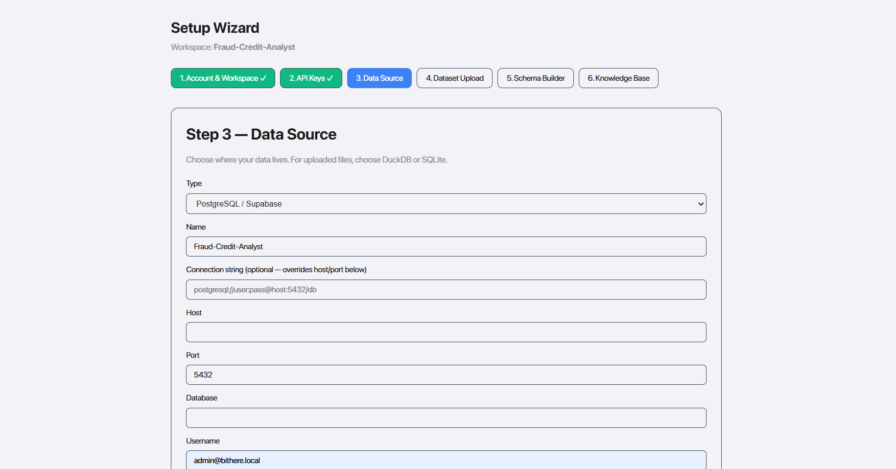
<br/>
<em>Example data warehouse loaded into Supabase PostgreSQL for demonstration.</em>
</div>

---

## Tech Stack

| Category | Technology |
| :--- | :--- |
| LLM | Groq (Llama 3.3 70B) — per workspace key |
| Embedding | OpenAI text-embedding-3-small — per workspace key |
| Vector Database | Pinecone — namespace per workspace |
| Source Database | PostgreSQL / MySQL / MongoDB / SQLite / DuckDB |
| Application Database | Supabase (PostgreSQL) with RLS |
| Cache | Redis with workspace prefix |
| Secret Vault | Fernet symmetric encryption |
| Backend | FastAPI, LangGraph |
| Frontend | React, Vite, Zustand |
| Visualization | Metabase |
| PDF Generation | WeasyPrint, FPDF2 fallback |
| Report Delivery | Slack Webhook, Resend, SMTP |
| Auth | Supabase Auth with JWT |
| Streaming | Server-Sent Events (SSE) |
| File Upload | FastAPI + pandas + DuckDB |
| DDL Editor | Monaco Editor |
| Rate Limiter | tenacity + asyncio.Semaphore |
| Deployment | Docker Compose (MinIO optional) |

---

## Dataset

The platform has been validated against two reference datasets:

### Fintech Fraud Dataset

| Table | Rows | Description |
| :--- | :--- | :--- |
| users | 1,219 | Customer profiles with age, income, credit score |
| cards | 4,061 | Card details with brand, type, limit, and dark web status |
| transactions | 1,000,000 | Card transactions with date, amount, merchant, and location |
| fraud_labels | 1,000,000 | Fraud labels per transaction |
| mcc_codes | 109 | Merchant Category Codes and descriptions |

### Superstore Analytics Dataset

Single-table retail dataset with 32 columns including category, sub-category, region, segment, order date, sales, profit, discount, and shipping details — used to validate multi-page dashboard generation with a geographic map.

---

## Installation and Setup

### Prerequisites

- Docker and Docker Compose
- Node.js 18 or later
- Python 3.10 or later
- Supabase account
- Pinecone account
- Groq API key
- Google AI Studio API key
- Resend API key or SMTP credentials
- Slack incoming webhook (optional)

### 1. Clone the Repository

```bash
git clone https://github.com/adikusumaa/BIthere-NLQ-Business-Intelligence-Dashboard-Generative.git
cd BIthere-NLQ-Business-Intelligence-Dashboard-Generative
```

### 2. Configure Environment Variables

Copy `.env.example` to `.env` and populate the platform-level values:

```env
MASTER_ENCRYPTION_KEY=generate-with-fernet

SUPABASE_URL=https://your-project.supabase.co
SUPABASE_ANON_KEY=your-anon-key
SUPABASE_SERVICE_ROLE_KEY=your-service-role-key
SUPABASE_DB_URL=postgresql://...

JWT_SECRET=your-jwt-secret

REDIS_URL=redis://redis:6379/0

METABASE_URL=http://metabase:3000
METABASE_USERNAME=admin@bithere.local
METABASE_PASSWORD=your-metabase-password

ALLOW_SELF_REGISTER=false
ALLOW_WORKSPACE_CREATION=admin_only
BOOTSTRAP_ADMIN_EMAIL=admin@bithere.local
BOOTSTRAP_ADMIN_PASSWORD=your-admin-password
```

> Per-workspace API keys (Groq, Google, Pinecone, Slack, Email) are **not** in `.env` — they are stored encrypted in the application database, entered by each user through the Setup Wizard.

### 3. Initialize the Database

Run the migrations in the Supabase SQL Editor:

```bash
scripts/migrations/002_workspace_tables.sql
scripts/migrations/003_workspace_glossary.sql
scripts/migrations/003_dashboard_versions.sql
scripts/migrations/004_workspace_invites.sql
```

### 4. Create the Pinecone Index

Create an index named `bithere-metadata` with 768 dimensions (for `gemini-embedding-001`) or 1536 dimensions (for `text-embedding-3-small`), metric set to cosine.

### 5. Start the Application Stack

```bash
docker compose up -d --build
```

Services will be available at:

| Service | URL |
| :--- | :--- |
| Backend API | http://localhost:8000 |
| API Documentation | http://localhost:8000/docs |
| Frontend | http://localhost:5173 |
| Metabase | http://localhost:3000 |

### 6. First-Time Login

On first startup, the backend creates a bootstrap admin using `BOOTSTRAP_ADMIN_EMAIL` and `BOOTSTRAP_ADMIN_PASSWORD`. Log in with those credentials. The Setup Wizard will guide you through the six onboarding steps.

---

## Usage

### Query Data with Natural Language

```text
How many fraud transactions occurred in January 2010?
```

```text
What is the average credit score of users who experienced fraud?
```

```text
Show me the top 10 merchant cities by fraud count.
```

### Generate a Multi-Page Dashboard

```text
Build a fraud analytics dashboard with two pages. Page one should
show KPI cards, monthly trend, and top 10 states. Page two should
show card brand, chip usage, and MCC category breakdown. Add global
filters for card brand, merchant state, chip usage, and card type.
```

### Iteratively Edit a Dashboard

Open any generated dashboard, click **Edit**, and then instruct the editor:

```text
Ubah warna chart 'Monthly Trend' jadi hijau.
```

```text
Tambahkan chart bar di atas 'Top 10 States' dengan judul 'Fraud by Card Brand'.
```

```text
Kembalikan ke versi 2.
```

### Generate and Deliver a Report

```text
Analyze fraud in January 2010, build a two-page dashboard with
monthly trend and breakdown by card brand, then send the report
to my email.
```

---

## Testing

Run all tests:

```bash
pytest test/ -v
```

Run a specific test module:

```bash
pytest test/test_query_generator.py -v -s
```

Test coverage includes encryption, workspace CRUD, connectors, dataset upload, schema builder, RAG ingestion, query generation, validation, optimization, caching, dashboard editing, and end-to-end chat. Over 300 tests pass against live services.

---

## Security and Compliance

| Aspect | Implementation |
| :--- | :--- |
| Authentication | Supabase Auth with JWT validation |
| Authorization | Role-based access control (owner, admin, analyst, viewer) |
| Query Safety | Validator agent enforces SELECT-only queries |
| SQL Injection | Parameter sanitization and allowlist validation |
| Secret Management | Fernet encryption with master key on the server only |
| Multi-Tenant Isolation | RLS + Pinecone namespace + Redis prefix + folder isolation |
| Audit Trail | Complete query history, patch history, ingestion logs |
| Data Isolation | Row-Level Security on application tables |
| Rate Limit Handling | Exponential backoff with retry policy |
| Error Handling | User-friendly messages with internal logging |

---

## Roadmap

| Phase | Description | Status |
| :--- | :--- | :--- |
| 1–8 | v1 Foundation (NLQ, Dashboard, Report, Agents, API, Frontend, Integration) | Completed |
| 9 | v1 Testing | Completed |
| 10 | v1 Finalization | Completed |
| 1–10 (v2) | Multi-Tenant Foundation, Workspace Core, Connectors, Upload, Schema Builder, RAG, API, Frontend, Integration, Testing | Completed |
| 11–18 (v2) | Iterative Dashboard Editor (F-13): State Model, Intent Parser, Validator, Applier, Metabase Adapter, Version Control, API Routes, Frontend Editor, Testing | Completed |

---

## Future Enhancements

- Self-hosted distribution bundle (docker pull, one command)
- Rate limit per workspace enforcement at the endpoint level
- Monitoring (Sentry, Prometheus, Grafana)
- Additional connectors (BigQuery, Redshift, Snowflake)
- Column-level lineage tracking
- SSO integration for enterprise deployment

---

## Contributing

1. Fork the repository.
2. Create a feature branch (`git checkout -b feature/AmazingFeature`).
3. Commit your changes (`git commit -m 'feat: add AmazingFeature'`).
4. Push to the branch (`git push origin feature/AmazingFeature`).
5. Open a Pull Request.

---

## License

Distributed under the MIT License. Developed by Adi Kusuma.